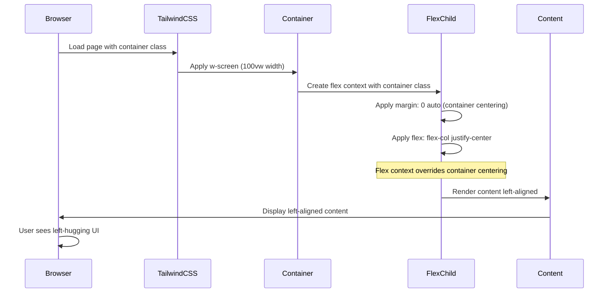

# Root Cause Analysis: UI Components Not Centered in Pitch Deck

## Incident Summary
**Date:** January 2025  
**Issue:** All UI components in the pitch deck are hugging the left side of the screen instead of being centered  
**Impact:** Poor visual presentation of the pitch deck  
**Status:** Identified - Pending Fix  

## Problem Description
The pitch deck slides are displaying with all content left-aligned instead of centered in the viewport. This affects the visual presentation and user experience of the pitch deck.

## Root Cause Analysis

### Primary Root Cause
**Incorrect application of Tailwind CSS `container` class in conjunction with flexbox layouts**

### Technical Details

#### 1. Configuration Analysis
- **Tailwind Config**: The `container` class is properly configured in `tailwind.config.ts`:
  ```typescript
  container: {
    center: true,
    padding: "2rem",
  }
  ```
- **Expected Behavior**: Container should center content with automatic left/right margins
- **Actual Behavior**: Content remains left-aligned

#### 2. Implementation Pattern Analysis
**Affected Components** (9 total):
- `section-problem.tsx`
- `section-solution.tsx` 
- `section-demo.tsx`
- `section-next.tsx`
- `section-team.tsx`
- `section-traction.tsx`
- `section-vision.tsx`
- `section-subscription.tsx`
- `section-start.tsx` (slightly different pattern)

**Common Anti-Pattern Found**:
```tsx
<div className="min-h-screen relative w-screen">
  <div className="flex flex-col min-h-screen justify-center container">
    <!-- Content -->
  </div>
</div>
```

#### 3. CSS Specificity and Cascade Issues
- **Parent Container**: Uses `w-screen` (100vw) creating full viewport width
- **Child Container**: Applies `container` class to a flex element
- **Conflict**: The `container` class's `margin: 0 auto` is overridden by the flex context
- **Result**: Content flows to the left edge instead of centering

#### 4. Layout Hierarchy Problems
```
Root: w-screen (100vw)
├── flex flex-col justify-center container
    ├── Content Grid (md:grid-cols-3)
        ├── Left Column
        ├── Center Column  
        └── Right Column
```

**Issue**: The `container` class is applied to the flex child, not the parent container, causing the centering mechanism to fail.

## Sequence of Events



## Contributing Factors

### 1. Inconsistent Layout Patterns
- **section-start.tsx**: Uses different pattern: `<div className="container min-h-screen relative">`
- **Other sections**: Use problematic flex + container combination
- **Inconsistency**: Makes the centering issue more apparent

### 2. Responsive Design Considerations
- Mobile layouts (px-4 md:px-0) work correctly due to padding
- Desktop layouts expose the centering issue more prominently
- Grid layouts (md:grid-cols-3) assume proper centering

### 3. CSS Framework Misunderstanding
- **Assumption**: Container class works in any context
- **Reality**: Container class requires specific DOM hierarchy to function properly
- **Gap**: Team knowledge of Tailwind container behavior

## Impact Assessment

### Visual Impact
- **Severity**: High - Affects presentation quality
- **Scope**: All 9 pitch deck slides
- **User Experience**: Unprofessional appearance

### Technical Impact
- **Performance**: No impact
- **Functionality**: No functional breakage
- **Maintainability**: Medium - Requires systematic fixes

## Recommended Solutions

### Option 1: Fix Container Class Application (Recommended)
```tsx
<div className="min-h-screen relative w-screen">
  <div className="container min-h-screen flex flex-col justify-center">
    <!-- Content -->
  </div>
</div>
```

### Option 2: Use Flexbox Centering
```tsx
<div className="min-h-screen relative w-screen flex items-center justify-center">
  <div className="w-full max-w-7xl px-8">
    <!-- Content -->
  </div>
</div>
```

### Option 3: Grid-Based Centering
```tsx
<div className="min-h-screen relative w-screen grid place-items-center">
  <div className="w-full max-w-7xl px-8">
    <!-- Content -->
  </div>
</div>
```

## Preventive Measures

### 1. Code Standards
- Document proper container class usage patterns
- Create component templates for consistent layouts
- Establish CSS class ordering conventions

### 2. Development Process
- Add visual regression testing
- Include layout review in PR process
- Create responsive design checklist

### 3. Knowledge Transfer
- Train team on Tailwind CSS container behavior
- Document common layout anti-patterns
- Create layout component library

## Implementation Plan

### Phase 1: Immediate Fix
1. Update all 9 affected section components
2. Apply consistent container pattern
3. Test across all breakpoints

### Phase 2: Systematic Improvements
1. Create layout component abstractions
2. Add visual regression tests
3. Update documentation

### Phase 3: Prevention
1. Implement linting rules for layout patterns
2. Create component library with proper layouts
3. Add automated layout testing

## Conclusion

The root cause is a systematic misapplication of the Tailwind CSS `container` class within flexbox contexts. The issue affects all pitch deck slides and requires a coordinated fix across 9 components. The solution is straightforward but requires careful implementation to maintain responsive behavior and visual consistency.

**Next Steps**: Implement Option 1 (Fix Container Class Application) across all affected components with proper testing.
