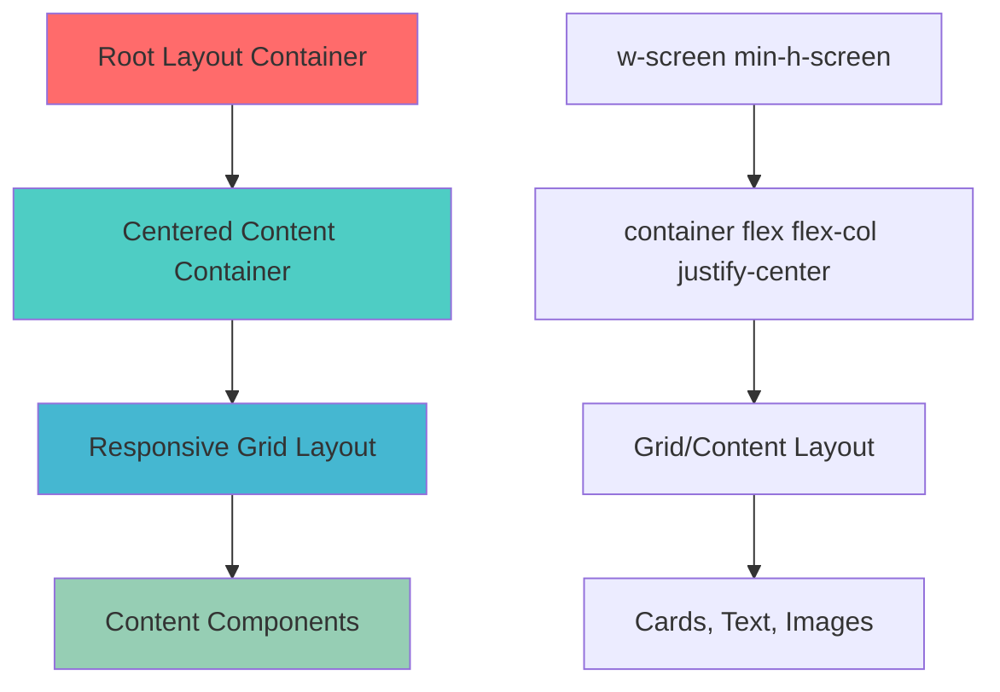

# Solutions Architecture Document: UI Centering Fix

## Executive Summary

This document outlines the comprehensive solution architecture for resolving the systematic UI centering issue identified in the pitch deck application. The solution addresses the root cause of improper Tailwind CSS container class application within flexbox contexts across 9 critical components.

**Solution Overview**: Implement a standardized layout pattern that properly applies container centering while maintaining responsive design and visual consistency.

## Problem Statement Review

### Root Cause Summary
- **Primary Issue**: Incorrect application of Tailwind CSS `container` class within flexbox contexts
- **Affected Components**: 9 pitch deck sections
- **Impact**: Left-aligned content instead of centered presentation
- **Severity**: High visual impact, medium technical complexity

### Technical Root Cause
```tsx
// CURRENT ANTI-PATTERN
<div className="min-h-screen relative w-screen">
  <div className="flex flex-col min-h-screen justify-center container">
    <!-- Container centering fails due to flex context override -->
  </div>
</div>
```

## Solution Architecture

### 1. Architecture Overview



### 2. Technical Solution Design

#### Solution Pattern (Recommended)
```tsx
// NEW STANDARDIZED PATTERN
<div className="min-h-screen relative w-screen">
  <div className="container min-h-screen flex flex-col justify-center">
    <!-- Properly centered content -->
  </div>
</div>
```

#### Key Design Principles
1. **Container First**: Apply `container` class to parent, not flex child
2. **Responsive Consistency**: Maintain existing responsive behavior
3. **Visual Hierarchy**: Preserve current layout structure
4. **Performance**: No impact on rendering performance

### 3. Component Architecture

#### Current State vs. Target State

| Component | Current Pattern | Target Pattern | Priority |
|-----------|----------------|----------------|----------|
| `section-problem.tsx` | Flex+Container | Container+Flex | High |
| `section-solution.tsx` | Flex+Container | Container+Flex | High |
| `section-demo.tsx` | Flex+Container | Container+Flex | High |
| `section-next.tsx` | Flex+Container | Container+Flex | Medium |
| `section-team.tsx` | Flex+Container | Container+Flex | Medium |
| `section-traction.tsx` | Flex+Container | Container+Flex | Medium |
| `section-vision.tsx` | Flex+Container | Container+Flex | Medium |
| `section-subscription.tsx` | Flex+Container | Container+Flex | Medium |
| `section-start.tsx` | Different Pattern | Standardize | Low |

## Technical Design Specifications

### 1. Layout Component Template

```tsx
// Standard Section Layout Template
interface SectionLayoutProps {
  children: React.ReactNode;
  className?: string;
  headerLeft?: string;
  headerRight?: string;
}

export function SectionLayout({ 
  children, 
  className, 
  headerLeft, 
  headerRight 
}: SectionLayoutProps) {
  return (
    <div className="min-h-screen relative w-screen">
      {/* Header */}
      {(headerLeft || headerRight) && (
        <div className="absolute left-4 right-4 md:left-8 md:right-8 top-4 flex justify-between text-lg">
          <span>{headerLeft}</span>
          <span className="text-[#878787]">{headerRight}</span>
        </div>
      )}
      
      {/* Main Content Container */}
      <div className={cn(
        "container min-h-screen flex flex-col justify-center",
        className
      )}>
        {children}
      </div>
    </div>
  );
}
```

### 2. CSS Class Hierarchy

```css
/* Expected CSS Application Order */
.container {
  width: 100%;
  margin-left: auto;
  margin-right: auto;
  padding-left: 2rem;
  padding-right: 2rem;
}

.flex {
  display: flex;
}

.flex-col {
  flex-direction: column;
}

.justify-center {
  justify-content: center;
}

.min-h-screen {
  min-height: 100vh;
}
```

### 3. Responsive Design Specifications

#### Breakpoint Behavior
- **Mobile (< 768px)**: Full width with padding
- **Tablet (768px - 1024px)**: Container max-width with centering
- **Desktop (> 1024px)**: Container max-width with centering

#### Container Configuration
```typescript
// tailwind.config.ts
container: {
  center: true,
  padding: "2rem",
  screens: {
    "2xl": "1400px",
  },
}
```

## Integration & Deployment Plan

### Phase 1: Immediate Critical Fixes (Day 1)

#### 1.1 High Priority Components
```bash
# Components requiring immediate attention
- src/components/section-problem.tsx
- src/components/section-solution.tsx  
- src/components/section-demo.tsx
```

#### 1.2 Implementation Steps
1. **Backup Current State**
   ```bash
   git checkout -b fix/ui-centering-issue
   git add .
   git commit -m "Backup: Before UI centering fixes"
   ```

2. **Apply Container Pattern Fix**
   - Update each component's root container structure
   - Test responsive behavior at each breakpoint
   - Verify visual consistency

3. **Validation Checklist**
   - [ ] Content centers properly on desktop
   - [ ] Mobile responsive behavior maintained
   - [ ] Grid layouts align correctly
   - [ ] No visual regressions

### Phase 2: Systematic Rollout (Days 2-3)

#### 2.1 Medium Priority Components
```bash
# Remaining affected components
- src/components/section-next.tsx
- src/components/section-team.tsx
- src/components/section-traction.tsx
- src/components/section-vision.tsx
- src/components/section-subscription.tsx
```

#### 2.2 Standardization Process
1. **Create Layout Component**
   - Implement `SectionLayout` component
   - Add TypeScript interfaces
   - Create usage documentation

2. **Progressive Migration**
   - Migrate one component at a time
   - Test between each migration
   - Document any edge cases

### Phase 3: Architecture Improvements (Days 4-5)

#### 3.1 Component Library Integration
```bash
# Create standardized components
src/components/layouts/
├── SectionLayout.tsx
├── ContentGrid.tsx
└── index.ts
```

#### 3.2 Testing Infrastructure
- Add visual regression tests
- Create component testing suite
- Implement responsive testing

## Risk Analysis & Mitigation

### 1. Technical Risks

#### High Risk: Responsive Layout Breakage
- **Risk**: Mobile layouts may break during migration
- **Mitigation**: Test each breakpoint thoroughly
- **Rollback**: Immediate revert if mobile issues detected

#### Medium Risk: Grid Layout Misalignment
- **Risk**: Three-column grids may not align properly
- **Mitigation**: Verify grid behavior in each component
- **Rollback**: Component-level rollback capability

#### Low Risk: Performance Impact
- **Risk**: Additional CSS classes may affect performance
- **Mitigation**: Monitor bundle size and runtime performance
- **Rollback**: Optimize CSS if performance degraded

### 2. Business Risks

#### High Risk: Visual Inconsistency
- **Risk**: Pitch deck appears unprofessional during migration
- **Mitigation**: Deploy fixes during low-traffic periods
- **Rollback**: Complete rollback within 5 minutes

#### Medium Risk: User Experience Disruption
- **Risk**: Sudden layout changes may confuse users
- **Mitigation**: Gradual rollout with monitoring
- **Rollback**: Feature flag implementation

## Rollback Strategy

### 1. Immediate Rollback (< 5 minutes)
```bash
# Git-based rollback
git checkout main
git reset --hard HEAD~1
npm run build
npm run start
```

### 2. Component-Level Rollback
```bash
# Selective component revert
git checkout HEAD~1 -- src/components/section-problem.tsx
git add .
git commit -m "Rollback: section-problem component"
```

### 3. Feature Flag Rollback
```tsx
// Emergency feature flag
const USE_NEW_LAYOUT = process.env.NEXT_PUBLIC_NEW_LAYOUT === 'true';

export function SectionProblem() {
  if (USE_NEW_LAYOUT) {
    return <NewLayoutComponent />;
  }
  return <LegacyLayoutComponent />;
}
```

## Success Metrics

### 1. Visual Quality Metrics
- **Centering Accuracy**: Content perfectly centered on desktop
- **Responsive Consistency**: Mobile layouts maintain proper spacing
- **Visual Hierarchy**: Grid layouts align correctly

### 2. Technical Metrics
- **Code Consistency**: All components use standardized pattern
- **Performance**: No degradation in page load times
- **Maintainability**: Reduced layout-related code complexity

### 3. User Experience Metrics
- **Visual Appeal**: Professional presentation quality
- **Cross-Device Consistency**: Uniform experience across devices
- **Accessibility**: Maintained accessibility standards

## Monitoring & Validation

### 1. Pre-Deployment Validation
```bash
# Automated testing checklist
npm run test:visual-regression
npm run test:responsive
npm run test:accessibility
npm run build
```

### 2. Post-Deployment Monitoring
- **Real-time visual monitoring**: Screenshot comparison
- **Performance monitoring**: Core Web Vitals tracking
- **Error tracking**: Layout-related JavaScript errors

### 3. Success Criteria
- [ ] All 9 components render centered content
- [ ] No responsive design regressions
- [ ] Performance metrics within acceptable range
- [ ] Zero layout-related user complaints

## Implementation Timeline

### Day 1: Critical Path
- 09:00 - 10:00: Environment setup and backup
- 10:00 - 12:00: Fix high-priority components (problem, solution, demo)
- 12:00 - 13:00: Testing and validation
- 13:00 - 14:00: Deploy to staging
- 14:00 - 15:00: Staging validation and approval
- 15:00 - 16:00: Production deployment

### Day 2: Systematic Rollout
- 09:00 - 12:00: Fix medium-priority components
- 12:00 - 13:00: Create SectionLayout component
- 13:00 - 15:00: Migration and testing
- 15:00 - 16:00: Deploy to production

### Day 3: Architecture Improvements
- 09:00 - 12:00: Implement component library
- 12:00 - 15:00: Add testing infrastructure
- 15:00 - 16:00: Documentation and handoff

## Conclusion

This solution architecture provides a comprehensive approach to resolving the UI centering issue while establishing a foundation for consistent layout patterns. The phased implementation approach minimizes risk while ensuring rapid resolution of the visual presentation problems.

**Key Benefits**:
- Immediate resolution of centering issues
- Standardized layout patterns for future development
- Improved maintainability and consistency
- Risk mitigation through phased deployment

**Next Steps**: Begin Phase 1 implementation with high-priority component fixes, followed by systematic rollout and architecture improvements. 